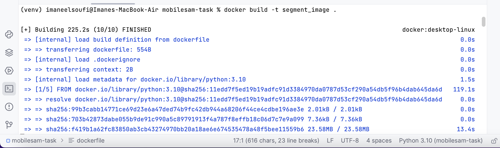
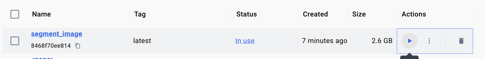

# Internship Take Home Assignment Solution- Software Engineer
This FastAPI service deploys the MobileSam segmentation model for image segmentation. Users can interact with the model by submitting image files through the `/segment-image` endpoint. We will explain in detail how to set it up, along with usage instructions.

# 1. Installation

 - Install Python (if not already installed): [PythonDownloads](https://www.python.org/downloads/) 
  - Clone the repository: 
    `git clone https://github.com/ImaneElSoufi/mobilesam-task`
   -  Navigate to the project directory:
     `cd fastapi-mobilesam`    
 -  Install dependencies:
  `pip install -r requirements.txt`

# 2. Setting up the environment
    python -m venv venv 
    source venv/bin/activate
  
# 3. Running the service locally
Run the FastAPI service using Uvicorn:
`uvicorn app:app --reload`

You should be able to see the startup of the application is complete:

# 4. Testing
**First method: using curl** 

In your bash write the following command:

    curl -X POST -F "file=@path/to/your/image.jpg" http://localhost:8000/segment-image

Change @path/to/your/image.jpg with the actual path to your input image.

**Second method: using Postman**

1.  **Create a POST Request:**
        Create a new request and set the request type to `POST`.
2.  **Set Request URL:**
     Enter the URL of your FastAPI endpoint: `http://localhost:8000/segment-image`.
3.  **Add Form Data:**
    -   Select the "Body" tab.
    -   Choose the `form-data` option.
    -   Add a key-value pair:
        -   Key: `file`
        -   Value: Select a file (your image file) using the "Choose Files" button.
4.  **Send Request:**
    Click the "Send" button to execute the request.

	 Here is an example:

5. **Review Response:**
Examine the response in the Postman interface. It should include the segmentation result.

# 5. Example of an input image and its output
We tested the app on postman using the input image:

Now, to see the segmented image, you can check it out in the generated output saved as: output.png
Here is our output image:

# 6. Docker
- Install [Docker Desktop](https://docs.docker.com/get-docker/) 

- We added the "dockerfile" in the repository. This file defines the instructions for building the Docker image:
  -   It uses the official Python 3.10 image as the base image.
  -   Sets the working directory to `/app`.
  -   Copies `requirements.txt` and installs dependencies.
  -   Copies the entire project into the container.
  -   Exposes port 8000.
  -   Sets an environment variable.
  -   Specifies the command to run our FastAPI app with Uvicorn.
  - 
- Now, open the terminal in the directory where your `dockerfile` is located and run the following command to build the Docker image:

    `docker build -t segment_image`
  
  You'll get this:

  

- Run Docker container
	- using the following command:
	`docker run -p 8000:8000 segment_image`
	- or by running the image on Docker Desktop:
	 
  
- Access  the API Service from the api requests.

